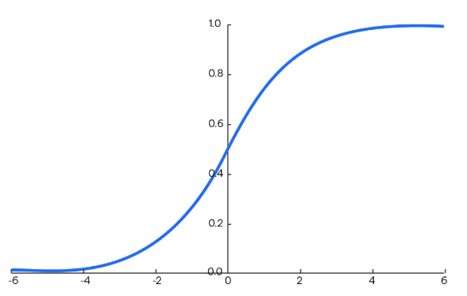

# Neural Net backpropagation Simulator

This is a simulator developed specifically to understand how the backpropagation algorithm works over a simple feedforward neural network.
The user can interact with the program by writing simple commands using the shell developed inside.

PS. so far it's only possible to create neural networks and compute all the values. The backprop algorithm will be developed soon.

## List of commands

all the following commands currently work to interact with the system

- **create net** *neural_net_name*
    create a new neural network. The name can be chosen arbitrarily.
    

        
    

        
    

        
    

        
    

        
    

        
    

        
    

        
    

        
    

        
    

        
    

        
    

        
    

        
    

        
    

        
    
 
  

- **sigmoid**\
$\text{sigmoid}(x) = \frac{1}{1 + e^{-x}}$

    

        
    

  

- **tanh**
$\text{tanh}(x) = \frac{e^{x} - e^{-x}}{e^{x} + e^{-x}}$
    

        
    
 
  

- **softmax**
$\text{softmax}(\mathbf{z})_i = \frac{e^{z_i}}{\sum_{j=1}^{K} e^{z_j}}$
    

        
    
 
  